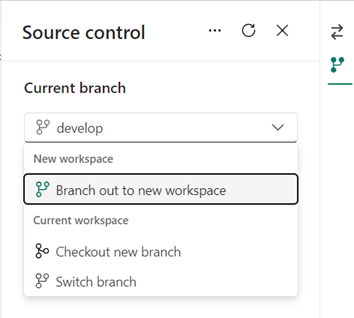

# Fabricon: The Basics

The document covers the concepts shared between various Fabricon patterns.

## 1. Getting started with Microsoft Fabric

Microsoft Fabric is fairly new platform and we are seeing new features being added every few weeks. This also means that there are a lot of gaps that engineers will need to work around to make their solutions work.

If you are new to Microsoft Fabric then it is important to understand the platform and what is offers. You can start with any of the following resources:

1. [What is Microsoft Fabric? - Microsoft Learn - Documentation](https://learn.microsoft.com/en-us/fabric/get-started/microsoft-fabric-overview)
2. [Getting started with Microsoft Fabric - Guy in a Cube - YouTube](https://www.youtube.com/playlist?list=PLv2BtOtLblH1RhbtfTpp9ovi3Y-3HiRO2)
3. [Microsoft Fabric Data Engineering End to End Demo - endjin - YouTube](https://www.youtube.com/playlist?list=PLJt9xcgQpM61fxyB1aWzWCAEsHZHEZD6w)

## 2. Environment Separation

The common items in Microsoft Fabric that are used for data manipulation are data pipelines and notebooks (referred to as code). In most cases, when your proof of concept (POC) is getting ready for prime time then you are likely to feel the need to keep the non production environment (DEV, TEST etc) separate from production environment.

We recommend a Fabric workspace for each environment. Lets say you are building a CRM data product and you decide that DEV and PROD environments are sufficient for your needs. We recommend a domain named `CRM` with following workspaces:

- `CRM-Dev`
- `CRM-Prod`

Each workspace contains all the items required for the data product, which may include lakehouse, data pipeline, notebook etc.

## 3. Medallion Architecture

The [Medallion Architecture](https://www.databricks.com/glossary/medallion-architecture) is a data processing architecture commonly used in data engineering to structure and refine data as it progresses through various stages of quality and usability.

Microsoft [recommends that you create each lakehouse in its own, separate Fabric workspace. This approach provides you with more control and better governance at the zone level.](https://learn.microsoft.com/en-us/fabric/onelake/onelake-medallion-lakehouse-architecture#deployment-model) Based on this recommendation that workspaces may look like:

- `CRM-Dev-Bronze`
- `CRM-Dev-Silver`
- `CRM-Dev-Gold`
- `CRM-Prod-Bronze`
- `CRM-Prod-Silver`
- `CRM-Prod-Gold`

Nine workspaces for just two environments may be an overkill for most projects, therefore Fabricon recommends following workspaces:

- `CRM-Dev`
- `CRM-Prod`

Each workspace has

- `CRM-Bronze` lakehouse
- `CRM-Silver` lakehouse
- `CRM-Gold` (or simply `CRM`) lakehouse/warehouse
- Data pipelines, if any
- Notebooks, if any

This approach allows teams to run their entire Medallion architecture workflows in lower environments without impacting production environment.

### 3.1 Lakehouse vs Warehouse

Another questions that teams run into is whether to choose a lakehouse or a warehouse for Medallion gold layer. Based on guidance from [Microsoft Fabric decision guide: Choose between Warehouse and Lakehouse](https://learn.microsoft.com/en-us/fabric/get-started/decision-guide-lakehouse-warehouse) we opted to use warehouse for gold layer and learned few things:

1. Warehouse requires upfront schema creation that requires use of [Visual Studio database project](https://learn.microsoft.com/en-us/fabric/data-warehouse/source-control).
2. The need to maintain warehouse via database project added complexity to our plans to automate deployments.
3. We tested query performance of lakehouse table against warehouse table and did not see any noticeable difference in performance.
4. We were able to switch from warehouse to lakehouse with no changes to our [Entity Framework Core](https://learn.microsoft.com/en-us/ef/core/) implementation.

As a result, we opted to use lakehouse for the flexibility if offers over the warehouse. Fabricon recommends that if you do not have an explicit need to use warehouse then use lakehouse instead.

### 3.2 Lakehouse Schema

Introduction of [lakehouse schema](https://learn.microsoft.com/en-us/fabric/data-engineering/lakehouse-schemas) helped simplify the Medallion architecture implementation.

Let's assume bronze layer lakehouse has following tables:

1. `dbo.Customer`
2. `dbo.Product`
3. `dbo.Order`

Let's assume that on silver layer you need to create a flat table that contains elements from all 3 tables above. On silver lakehouse, Fabric shortcuts can used to provide access to bronze tables:

1. `Bronze.Customer`
2. `Bronze.Product`
3. `Bronze.Order`

The above tables can be easily used in a Spark notebook to read data from bronze layer and write to `dbo.CustomerOrder` table on silver layer.

`dbo` schema represents current Medallion layer (silver) and `Bronze` schema represents bronze Medallion layer.

Similarly, on gold Medallion layer the lakehouse can have following schema:

1. `dbo` to represent gold layer
2. `Silver` to represent silver layer

This approach enables access to multiple Medallion layers within the constraint of having only one lakehouse available in session context, with clear distinction of layer via schema.

## 4. Source Control

For the CRM example, Fabricon suggest following branching strategy:

- `main` branch linked with `CRM-Prod` workspace
- `develop` branch linked with `CRM-Dev` workspace
- `Branch out to new workspace` feature is used to create a new workspace from `CRM-Dev`. This new workspace will be linked to `feature` branch.
- Use `pull request` to merge `feature` branch in `develop` branch. This will promote code to `CRM-Dev` workspace.
- Use `pull request` to merge `develop` branch in `main` branch. This will promote code to `CRM-Prod` workspace.

## 5. Code Organization Using Notebooks

4. Source control
5. Unit testing
6. Automated documentation
7. Branching strategy
8. Deployment to production
9. Auditing