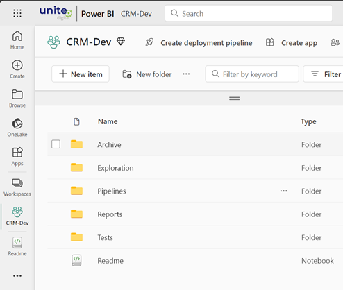

# Fabricon 1: Basic Environment Segregation

The common items in Microsoft Fabric that are used for data manipulation are data pipelines and notebooks (referred to as code). In most cases, when your proof of concept (POC) is getting ready for prime time then you are likely to feel the need to keep the non production environment (DEV, TEST etc) separate from production environment.

> Fabricon recommends a Fabric workspace for each environment. 

Let's say you are building a CRM data product and you decide that DEV and PROD environments are sufficient for your needs. We recommend a domain named `CRM` with following workspaces:

- `CRM-Dev`
- `CRM-Prod`

Each workspace contains all the items required for the data product, which may include lakehouse, data pipeline, notebook etc.

Fabricon recommends following folder structure to organize code. Lakehouse/warehouse can be on the root on the workspace.

