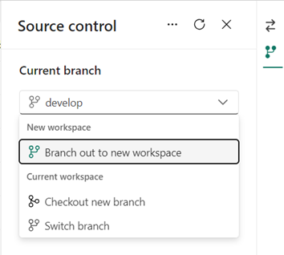

# Fabricon 2: Medallion-Based Environment Architecture

> Fabricon 2 builds on what is presented in [Fabricon 1](../Fabricon1/README.md).

The [Medallion Architecture](https://www.databricks.com/glossary/medallion-architecture) is a data processing architecture commonly used in data engineering to structure and refine data as it progresses through various stages of quality and usability.

Microsoft [recommends that you create each lakehouse in its own, separate Fabric workspace](https://learn.microsoft.com/en-us/fabric/onelake/onelake-medallion-lakehouse-architecture#deployment-model). Based on this recommendation that workspaces may look like:

- `CRM-Dev-Bronze`
- `CRM-Dev-Silver`
- `CRM-Dev-Gold`
- `CRM-Prod-Bronze`
- `CRM-Prod-Silver`
- `CRM-Prod-Gold`

Nine workspaces for just two environments may be an overkill for most projects, therefore Fabricon recommends following workspaces:

- `CRM-Dev`
- `CRM-Prod`

Each workspace has

- `CRM-Bronze` lakehouse
- `CRM-Silver` lakehouse
- `CRM-Gold` (or simply `CRM`) lakehouse/warehouse
- Data pipelines, if any
- Notebooks, if any

This approach allows teams to run their entire Medallion architecture workflows in lower environments without impacting production environment.

## Lakehouse vs Warehouse

Another questions that teams run into is whether to choose a lakehouse or a warehouse for Medallion gold layer. Based on guidance from [Microsoft Fabric decision guide: Choose between Warehouse and Lakehouse](https://learn.microsoft.com/en-us/fabric/get-started/decision-guide-lakehouse-warehouse) we opted to use warehouse for gold layer and learned few things:

1. Warehouse requires upfront schema and table creation.
2. To maintain warehouse, teams need to use [Visual Studio database project](https://learn.microsoft.com/en-us/fabric/data-warehouse/source-control) that adds complexity to automated deployments.
3. Query performance of lakehouse table is comparable to warehouse table.
4. [Entity Framework Core](https://learn.microsoft.com/en-us/ef/core/) works well with both the warehouse and the lakehouse.

As a result, we opted to use lakehouse for the flexibility if offers over the warehouse.
> Fabricon recommends that if you do not have an explicit need to use warehouse then use lakehouse instead.

## Lakehouse Schema

Introduction of [lakehouse schema](https://learn.microsoft.com/en-us/fabric/data-engineering/lakehouse-schemas) can help simplify the Medallion architecture implementation.

Let's assume bronze layer lakehouse has following tables:

1. `dbo.Customer`
2. `dbo.Product`
3. `dbo.Order`

> Notebook can only connect to one lakehouse at a time referred to as default lakehouse.

Let's assume that on silver layer you need to create a flat table that contains elements from all 3 tables above. On silver lakehouse, [shortcuts](https://learn.microsoft.com/en-us/fabric/data-engineering/lakehouse-shortcuts) can used to get access to bronze tables:

1. `Bronze.Customer` shortcut points to `dbo.Customer`
2. `Bronze.Product` shortcut points to `dbo.Product`
3. `Bronze.Order` shortcut points to `dbo.Order`

The above tables can be easily used in a Spark notebook to read data from bronze layer and write to `dbo.CustomerOrder` table on silver layer.

> Fabricon recommends that `dbo` schema is used represent current Medallion layer and named schema (`Bronze` and `Silver`) are used to represent bronze and silver layer.

Similarly, on gold Medallion layer the lakehouse can have following schema:

1. `dbo` to represent gold layer
2. `Silver` to represent silver layer

This approach enables access to multiple Medallion layers within the constraint of having only one lakehouse available in session context, with clear distinction of layer via schema.

## Source Control

For the CRM example, Fabricon suggest following branching strategy:

- `main` branch linked with `CRM-Prod` workspace
- `develop` branch linked with `CRM-Dev` workspace
- `Branch out to new workspace` feature is used to create a new workspace from `CRM-Dev`. This will create new workspace linked to new feature branch.
- Use pull request to merge feature branch in `develop` branch. This will promote code to `CRM-Dev` workspace.
- Use pull request to merge `develop` branch in `main` branch. This will promote code to `CRM-Prod` workspace.



## Folder Structure

Fabricon recommends following folder structure:

- **Archive**: Folder to keep archived items before they are deleted.
- **Exploration**: Folder to keep items used for research purposes.
- **Pipelines**: Folder to keep items related to the main workflow. See [Fabricon N](../FabriconN/README.md) for recommended pipeline orchestration and code organization.
- **Reports**: Folder to keep Power BI reports. See [Fabricon R](../FabriconR/README.md) for guidance on promoting reports across environments — Fabricon R recommends placing reports in Data workspaces instead.
- **Tests**: Folder to keep items that test pipelines.

Readme notebook should be on the root of each workspace that has necessary information.

```text
CRM-Dev / CRM-Prod
├── 📁 Archive
├── 📁 Exploration
├── 📁 Pipelines
├── 📁 Reports
├── 📁 Tests
└── 📓 Readme
```

> When using [Fabricon R](../FabriconR/README.md), the Reports folder moves to the Data workspace:

```text
Code Workspace (CRM-Dev / CRM-Prod)
├── 📁 Archive
├── 📁 Exploration
├── 📁 Pipelines
├── 📁 Tests
└── 📓 Readme

Data Workspace (CRM-Data-Dev / CRM-Data-Prod)
├── 📁 Reports
├── 🗄️ CRM-Bronze Lakehouse
├── 🗄️ CRM-Silver Lakehouse
└── 🗄️ CRM-Gold Lakehouse
```

## Pipeline Notifications

> Fabricon recommends sending email notifications on pipeline completion with detailed execution results.

Production pipelines should notify stakeholders of execution outcomes. A common pattern is to generate an HTML email with per-step results including step name, start/end times, duration, success/failure status, and notes.

Teams can use the [Office 365 Connector](https://learn.microsoft.com/en-us/connectors/office365/) or similar service to send these notifications. For a structured approach to capturing per-step results, see [Fabricon N - Pipeline Result Tracking](../FabriconN/README.md#1-pipeline-result-tracking).

## What Fabricon 2 Solves

| Problem | Solution |
| --- | --- |
| Microsoft recommends 9 workspaces for 2 environments — overkill for most projects | 2 workspaces with multiple lakehouses per workspace |
| Lakehouse vs warehouse decision | Lakehouse recommended for flexibility, comparable performance, no upfront schema |
| Notebooks can only connect to one lakehouse at a time | Shortcuts + named schemas (`Bronze.*`, `Silver.*`) for cross-layer access |
| No structured data organization across medallion layers | `dbo` schema for current layer, named schemas for other layers |
| No branching strategy for Fabric | `main` ↔ Prod, `develop` ↔ Dev, feature branches via "Branch out to new workspace" |
| No visibility into pipeline execution outcomes | HTML email notifications with per-step results |

## References

- [Medallion Architecture](https://www.databricks.com/glossary/medallion-architecture)
- [OneLake Medallion Lakehouse Architecture](https://learn.microsoft.com/en-us/fabric/onelake/onelake-medallion-lakehouse-architecture)
- [Decision Guide: Choose Between Warehouse and Lakehouse](https://learn.microsoft.com/en-us/fabric/get-started/decision-guide-lakehouse-warehouse)
- [Lakehouse Schemas](https://learn.microsoft.com/en-us/fabric/data-engineering/lakehouse-schemas)
- [Lakehouse Shortcuts](https://learn.microsoft.com/en-us/fabric/data-engineering/lakehouse-shortcuts)
- [Git Integration in Fabric](https://learn.microsoft.com/en-us/fabric/cicd/git-integration/intro-to-git-integration)
- [Office 365 Connector](https://learn.microsoft.com/en-us/connectors/office365/)
