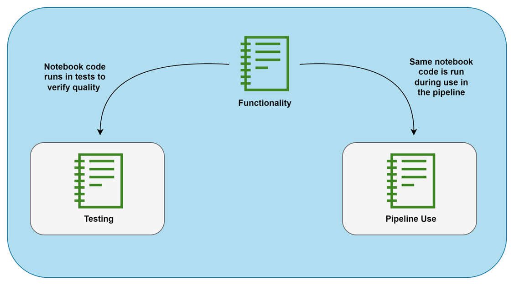
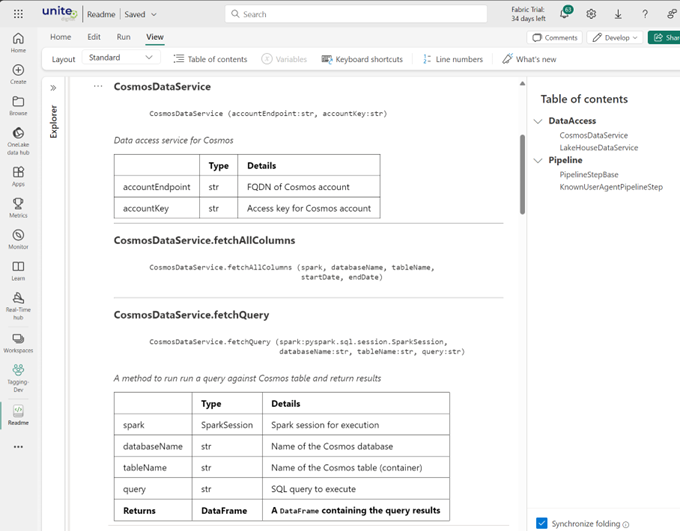

# Fabricon N: Code Organization Using Notebooks

> Fabricon N is an extension that can used with either [Fabricon 1](../Fabricon1/README.md), [Fabricon 2](../Fabricon2/README.md) or [Fabricon 3](../Fabricon3/README.md). Use of Fabricon 1 with Fabricon N extension may be referred to as Fabricon 1N and so on.

Traditionally, notebooks are used to different steps in a ETL pipeline where generally a notebook cell represents a step in the pipeline. These notebooks run top to bottom like a script.

> Fabricon recommends using classes to organize the code and abstract classes to enforce contract.

Fabricon recommends using classes to organize the code in a way that ensure consistency and enhances testability of the code. Use of abstract class is encouraged to establish a contract for all pipeline steps. In most cases, pipeline steps read data from a source, perform transformation and save to a lakehouse. A sample abstract is listed below that can be used to enforce common contract on all pipeline steps.

```python
# PipelineStepBase

from abc import ABC, abstractmethod
from pyspark.sql import DataFrame


class PipelineStepBase(ABC):
    """Abstract Base class for all pipeline classes"""

    @abstractmethod
    def _get_data(self) -> DataFrame:  # A `DataFrame` containing the query results
        """Mehtod to get data need to run this pipeline step"""
        pass

    @abstractmethod
    def _write_to_lakehouse(
        self, df: DataFrame  # A `DataFrame` containing the query results
    ):
        """Mehtod to write data from this pipeline step to lakehouse"""
        pass

    @abstractmethod
    def run(self) -> Boolean:
        """Method to run the pipeline step"""
        pass

```

Simple implementation of a pipeline step may look like below:

```python
# CrmCustomerPipelineStep

class CrmCustomerPipelineStep(PipelineStepBase):    
    def _get_data(self) -> DataFrame:
        # Code to fetch customer data.
        return data_df

    def _write_to_lakehouse(self, df):       
        # Code to write dataframe to lakehouse as delta table.

    def run(self) -> Boolean:
        result = True        
        try:
            df = self._get_data()
            self._write_to_lakehouse(df)
        except Exception as ex:
            result = False
            # Code to handle exception.
        finally:
            return result
```

The orchestrator `00 - Main` notebook may look like:

```python
# Run magic command run to bring in the code of CrmCustomerPipelineStep notebook into current context.
%run CrmCustomerPipelineStep 
```

```python
crm_customer_step = CrmCustomerPipelineStep()
crm_customer_step_result = crm_customer_step.run()

print(f"CrmCustomerPipelineStep ended with status: {crm_customer_step_result}")
```

> With this approach, adding numeric prefix to each pipeline step is not needed and the order of execution of steps can be easily changed within the orchestrator.

## 3. Code Reusability Using Python Wheel Packages

Magic command `run` is limited to running notebooks in current workspace. `notebookutils` has a function that can [run a notebook from any workspace](https://learn.microsoft.com/en-us/fabric/data-engineering/notebook-utilities#reference-a-notebook), but the content of notebook are not brought into the current context.

Using [Python Binary Distribution Format](https://packaging.python.org/en/latest/specifications/binary-distribution-format/) teams can easily package shared code that can easily consumed in any notebook.

> Fabricon recommends using inline package install instead of creating custom Spark environment. Custom Spark environment take longer to start and harder to maintain.

Creating custom Spark environment with all custom libraries is a good way to hide complexity from the users, but it increases session start time from 3-10 seconds to 50-120 seconds. 

An alternate approach is to publish your wheel package to a blob store and use `%pip install https://yourblobstore.com/youpythonpackage.whl?accesstoken` to load the package where needed.

## 4. Unit Testing

There are many good unit testing strategies and frameworks available for Python. Fabricon recommends using folder structure presented in [Fabricon 1](../Fabricon1/README.md) and have test coverage using following strategy:



## 5. Automated Documentation

Teams using [GitHub](https://github.com) can make use of [nbdev](https://nbdev.fast.ai) to automatically generate documentation from code as [GitHub Pages](https://pages.github.com).

Teams using [Azure DevOps](https://dev.azure.com) can use `showdoc` function from [nbdev](https://nbdev.fast.ai) to automatically generate documentation in notebooks like shown below:



## 6. Code Formatting

Fabricon recommends using [jupyter-black](https://pypi.org/project/jupyter-black) extension to automatically format Python code in notebooks.

## 7. Deployment

Microsoft Fabric offers two ways to promote code from one environment to another.

1. [Fabric Deployment Pipelines](https://learn.microsoft.com/en-us/fabric/cicd/deployment-pipelines/intro-to-deployment-pipelines?tabs=new)
2. [Fabric Git Integration](https://learn.microsoft.com/en-us/fabric/cicd/git-integration/intro-to-git-integration?tabs=azure-devops)

> See [Fabricon 2 - Source Control](../Fabricon2/README.md#source-control) for recommendations on Git integration.

In context of Fabricon N, the main challenge is how to change default lakehouse for notebooks so they are linked to correct lakehouse when code is promoted to one environment to another.

At the time of writing, Fabric deployment pipelines support this via [Deployment Rules](https://learn.microsoft.com/en-us/fabric/cicd/deployment-pipelines/create-rules?tabs=new), but it is manual and impractical for bigger projects.

At the time of writing, Fabric Git integration does not support updating default lakehouse on notebooks. Fabricon recommends using a post deployment notebook that programmatically updates default lakehouse on notebooks with code.

[`notebookutils`](https://learn.microsoft.com/en-us/fabric/data-engineering/notebook-utilities#updating-a-notebook) can be used to change default lakehouse on notebooks.

```python
notebookutils.notebook.updateDefinition(
        name=notebook_name,
        defaultLakehouse=lakehouse_name,
        defaultLakehouseWorkspace=workspace_id
    )
```

> Remember, the notebook running `updateDefinition` function cannot update itself.


