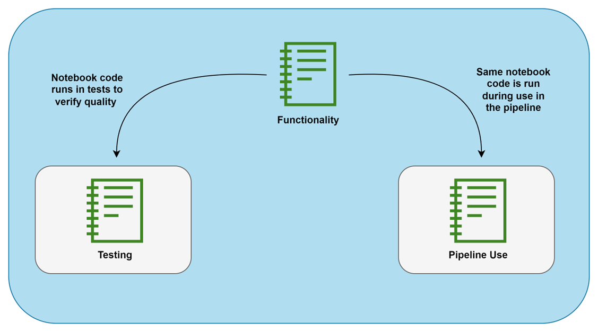
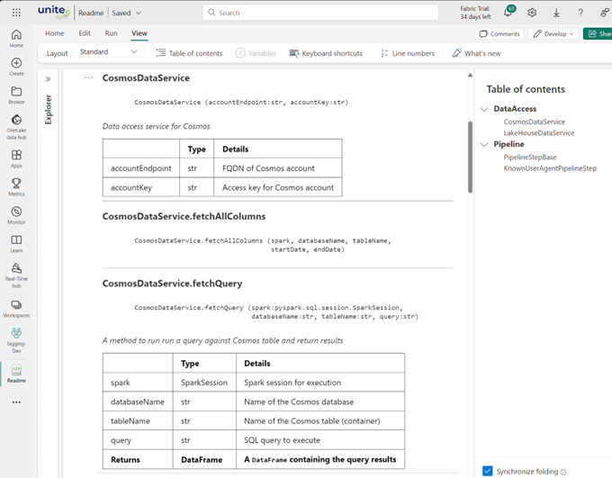

# Fabricon N: Code Organization Using Notebooks

> Fabricon N is an extension that can used with either [Fabricon 1](../Fabricon1/README.md), [Fabricon 2](../Fabricon2/README.md) or [Fabricon 3](../Fabricon3/README.md). Use of Fabricon 1 with Fabricon N extension may be referred to as Fabricon 1N and so on.

Traditionally, notebooks are used to different steps in a ETL pipeline where generally a notebook cell represents a step in the pipeline. These notebooks run top to bottom like a script.

> Fabricon recommends using classes to organize the code and abstract classes to enforce contract.

Fabricon recommends using classes to organize the code in a way that ensure consistency and enhances testability of the code. Use of abstract class is encouraged to establish a contract for all pipeline steps. In most cases, pipeline steps read data from a source, perform transformation and save to a lakehouse. A sample abstract is listed below that can be used to enforce common contract on all pipeline steps.

## 1. Pipeline Result Tracking

Fabricon recommends defining a `PipelineResult` class that captures execution details for each step. A sample is listed below:

```python
# PipelineStepBase

from datetime import datetime

class PipelineResult:
    def __init__(self, step_name: str):
        self.step_name:str = step_name
        self.is_success:bool = False
        self.message:str = None
        self.start_time:datetime = None
        self.end_time:datetime = None
        self.exception:Exception = None

    def __str__(self):
        return f"step_name: {self.step_name}, is_success: {self.is_success}, message: {self.message}, execution_time: {self.end_time - self.start_time}"

    def start(self):
        self.start_time = datetime.now()

    def complete(self, success: bool, message: str, exception: Exception = None):
        self.end_time = datetime.now()
        self.message = message
        self.is_success = success
        self.exception = exception
```

A `PipelineResultList` class can be used to aggregate results across pipeline steps:

```python
class PipelineResultList:
    def __init__(self):
        self._results = []

    def add(self, result):
        if not isinstance(result, PipelineResult):
            raise TypeError("Only PipelineResult objects can be added.")
        self._results.append(result)

    def __iter__(self):
        return iter(self._results)

    def __len__(self):
        return len(self._results)
```

## 2. Pipeline Step Contract

With `PipelineResult` in place, the abstract class can be updated to use it as the return type for `run()`. A sample abstract class is listed below that can be used to enforce common contract on all pipeline steps.

```python
from abc import ABC, abstractmethod
from pyspark.sql import DataFrame


class PipelineStepBase(ABC):
    """Abstract Base class for all pipeline classes"""

    @abstractmethod
    def _get_data(self) -> DataFrame:  # A `DataFrame` containing the query results
        """Mehtod to get data need to run this pipeline step"""
        pass

    @abstractmethod
    def _write_to_lakehouse(
        self, df: DataFrame  # A `DataFrame` containing the query results
    ):
        """Mehtod to write data from this pipeline step to lakehouse"""
        pass

    @abstractmethod
    def run(self) -> PipelineResult:
        """Method to run the pipeline step"""
        pass

```

Simple implementation of a pipeline step may look like below:

```python
# CrmCustomerPipelineStep

class CrmCustomerPipelineStep(PipelineStepBase):
    def __init__(self, spark):
        self.spark = spark

    def _get_data(self) -> DataFrame:
        # Code to fetch customer data.
        return data_df

    def _write_to_lakehouse(self, df):
        # Code to write dataframe to lakehouse as delta table.
        pass

    def run(self) -> PipelineResult:
        result = PipelineResult("CrmCustomerPipelineStep")
        result.start()
        try:
            df = self._get_data()
            self._write_to_lakehouse(df)
            result.complete(True, f"Processed {df.count()} records")
        except Exception as ex:
            result.complete(False, str(ex), ex)
            raise ex
        finally:
            return result
```

### Development Mode

> Fabricon recommends using an environment variable to distinguish between pipeline execution and individual notebook development/testing.

Each pipeline step notebook should include a test block at the bottom that only runs when the notebook is executed directly (not as part of a pipeline):

```python
if __name__ == "__main__" and os.getenv("PIPELINE_RUN") != "True":
    step = CrmCustomerPipelineStep(spark)
    result = step.run()
    print(result)
```

The orchestrator notebooks set this flag before running steps:

```python
os.environ["PIPELINE_RUN"] = "True"
```

## 3. Tiered Orchestration

> Fabricon recommends using a `00 - Main` Data Pipeline to orchestrate Medallion tier notebooks in order.

The `00 - Main` is a Fabric Data Pipeline that runs Bronze, Silver, and Gold tier notebooks sequentially:

- `00 - Main` - Fabric Data Pipeline that orchestrates the tier notebooks
- `01 - Bronze.Notebook` - Runs all bronze (ingestion) steps
- `02 - Silver.Notebook` - Runs all silver (transformation) steps
- `03 - Gold.Notebook` - Runs all gold (aggregation/metric) steps

This separation allows each tier to:

- Have its own timeout and retry settings
- Report success/failure independently
- Be re-run individually without re-running the entire pipeline

> Fabric has a limit on notebook reference chain depth. When `00 - Main` calls a tier notebook (e.g., `01 - Bronze`), which uses `%run` to import `PipelineStepBase`, which in turn uses `%run Common`, the chain can exceed the allowed depth - especially when pipeline steps import additional notebooks. If you hit this limit, a practical workaround is to schedule each tier notebook (`01 - Bronze`, `02 - Silver`, `03 - Gold`) independently instead of chaining them through `00 - Main`.

Each tier notebook follows this pattern:

```python
# Setup
%run Common
```

```python
os.environ["PIPELINE_RUN"] = "True"
```

```python
from datetime import datetime

start_time = datetime.now()
```

```python
# Import pipeline steps
%run CrmCustomerPipelineStep
%run CrmProductPipelineStep
```

```python
try:
    result_list = PipelineResultList()
    status = "Success"

    pipeline_steps = [
        CrmCustomerPipelineStep(spark),
        CrmProductPipelineStep(spark),
    ]

    for step in pipeline_steps:
        result = step.run()
        result_list.add(result)

        if not result.is_success:
            raise result.exception

except Exception as ex:
    status = "Error"
    # Handle error (send notification, log, etc.)
finally:
    # Send email notification with result_list
    pass
```

> With this approach, adding numeric prefix to each pipeline step is not needed and the order of execution of steps can be easily changed within the orchestrator.

## 4. Data Access Abstraction

> Fabricon recommends abstracting data access into a shared service to ensure consistency across pipeline steps.

Instead of each pipeline step writing its own data access logic, Fabricon recommends creating a shared data access service (via a [Python wheel package](#6-code-reusability-using-python-wheel-packages)) with common operations. A sample is listed below:

```python
class LakeHouseDataService:
    def __init__(self, spark, notebookutils, delta_table):
        self.spark = spark
        self.notebookutils = notebookutils
        self.delta_table = delta_table

    def execute_query(self, sql: str) -> DataFrame:
        # Execute a SQL query and return results as DataFrame.
        return self.spark.sql(sql)

    def execute_scalar(self, sql: str, column: str, default=None):
        # Execute a SQL query and return a single scalar value.
        result = self.spark.sql(sql).collect()
        if result and result[0][column] is not None:
            return result[0][column]
        return default

    def upsert(self, df: DataFrame, table: str, merge_condition: str, update_columns: list = None):
        # Perform a Delta Lake MERGE (upsert) operation.
        pass

    def replace(self, df: DataFrame, table: str):
        # Replace all data in a table.
        df.write.mode("overwrite").format("delta").saveAsTable(table)

    def read_json_file(self, path: str, schema) -> DataFrame:
        # Read a JSON file from lakehouse Files.
        return self.spark.read.schema(schema).json(path)

    def read_csv_file(self, path: str, schema) -> DataFrame:
        # Read a CSV file from lakehouse Files.
        return self.spark.read.schema(schema).csv(path, header=True)
```

Usage in a pipeline step may look like below:

```python
class CrmCustomerPipelineStep(PipelineStepBase):
    def __init__(self, spark):
        self.spark = spark
        self.data_service = LakeHouseDataService(spark, notebookutils, DeltaTable)

    def _get_data(self):
        return self.data_service.execute_query("SELECT * FROM Bronze.Customer")

    def _write_to_lakehouse(self, df):
        self.data_service.upsert(df, "dbo.Customer", "existing.Id = updates.Id")
```

## 5. Incremental Processing

Full reprocessing of data is impractical for growing datasets. Fabricon recommends incremental processing where each pipeline step tracks the maximum date already processed and only fetches new data. A sample is listed below:

```python
def _get_data(self):
    max_date = self.data_service.execute_scalar(
        "SELECT MAX(Date) AS MaxDate FROM dbo.CustomerMetric",
        "MaxDate",
        CRM_START_DATE  # Fallback for first run
    )

    return self.data_service.execute_query(f"""
        SELECT * FROM Bronze.CustomerEvent
        WHERE Date >= '{max_date}'
    """)

def _write_to_lakehouse(self, df):
    self.data_service.upsert(
        df, "dbo.CustomerMetric",
        "existing.CustomerId = updates.CustomerId AND existing.Date = updates.Date"
    )
```

Use `upsert` (Delta MERGE) for incremental updates and `replace` (overwrite) for reference data that should be fully refreshed.

## 6. Code Reusability Using Python Wheel Packages

Magic command `run` is limited to running notebooks in current workspace. `notebookutils` has a function that can [run a notebook from any workspace](https://learn.microsoft.com/en-us/fabric/data-engineering/notebook-utilities#reference-a-notebook), but the content of notebook are not brought into the current context.

Using [Python Binary Distribution Format](https://packaging.python.org/en/latest/specifications/binary-distribution-format/) teams can easily package shared code that can easily consumed in any notebook.

> Fabricon recommends using inline package install instead of creating custom Spark environment. Custom Spark environment take longer to start and harder to maintain.

Creating custom Spark environment with all custom libraries is a good way to hide complexity from the users, but it increases session start time from 3-10 seconds to 50-120 seconds.

An alternate approach is to publish your wheel package to a blob store and use `%pip install https://yourblobstore.com/youpythonpackage.whl?accesstoken` to load the package where needed.

Good candidates for packaging as a wheel include data access service (e.g., `LakeHouseDataService`), logger and email sender.

## 7. Unit Testing

There are many good unit testing strategies and frameworks available for Python. Fabricon recommends that each notebook containing functionality is also used in a test notebook that verifies quality. The same notebook code that runs in tests is then run during use in the pipeline.



## 8. Automated Documentation

Teams using [GitHub](https://github.com) can make use of [nbdev](https://nbdev.fast.ai) to automatically generate documentation from code as [GitHub Pages](https://pages.github.com).

Teams using [Azure DevOps](https://dev.azure.com) can use `showdoc` function from [nbdev](https://nbdev.fast.ai) to automatically generate documentation in notebooks like shown below:



## 9. Code Formatting

Fabricon recommends using [jupyter-black](https://pypi.org/project/jupyter-black) extension to automatically format Python code in notebooks.

## 10. Deployment

Microsoft Fabric offers two ways to promote code from one environment to another.

1. [Fabric Deployment Pipelines](https://learn.microsoft.com/en-us/fabric/cicd/deployment-pipelines/intro-to-deployment-pipelines?tabs=new)
2. [Fabric Git Integration](https://learn.microsoft.com/en-us/fabric/cicd/git-integration/intro-to-git-integration?tabs=azure-devops)

> See [Fabricon 2 - Source Control](../Fabricon2/README.md#source-control) for recommendations on Git integration.

In context of Fabricon N, the main challenge is how to change default lakehouse for notebooks so they are linked to correct lakehouse when code is promoted to one environment to another.

At the time of writing, Fabric deployment pipelines support this via [Deployment Rules](https://learn.microsoft.com/en-us/fabric/cicd/deployment-pipelines/create-rules?tabs=new), but it is manual and impractical for bigger projects.

At the time of writing, Fabric Git integration does not support updating default lakehouse on notebooks. Fabricon recommends using a post deployment notebook that programmatically updates default lakehouse on notebooks with code.

[`notebookutils`](https://learn.microsoft.com/en-us/fabric/data-engineering/notebook-utilities#updating-a-notebook) can be used to change default lakehouse on notebooks.

```python
notebookutils.notebook.updateDefinition(
        name=notebook_name,
        defaultLakehouse=lakehouse_name,
        defaultLakehouseWorkspace=workspace_id
    )
```

> Remember, the notebook running `updateDefinition` function cannot update itself.

Fabricon recommends having a notebook for environment variables and another notebook to run post deployment updates to point the notebooks containing code to correct lakehouse.

Following code shows contents of `PostDeployment` notebook:

```python
# Environment variables are defined in Common.
%run Common
```

```python
from notebookutils import notebook
from concurrent.futures import ThreadPoolExecutor
import os
import json

if os.getenv("DATA_WORKSPACE_ID") == None:
    notebookutils.notebook.exit("`DATA_WORKSPACE_ID` is not defined")

# Function to update notebook definition
def update_notebook(notebook_item):
    notebook_name = notebook_item['displayName']
    notebook_lakehouse_name = json.loads(notebookutils.notebook.getDefinition(nb["displayName"]))["metadata"]["dependencies"]["lakehouse"]["default_lakehouse_name"]

    # Skip if the notebook name is "DevOps"
    if notebook_name == "DevOps":
        print(f"Skipping notebook '{notebook_name}'")
        return

    notebook.updateDefinition(
        name=notebook_name,
        defaultLakehouse=notebook_lakehouse_name,
        defaultLakehouseWorkspace=os.getenv("DATA_WORKSPACE_ID")
    )
    print(f"Updated notebook definition for '{notebook_name}'")

# Get the list of notebooks
notebook_list = notebookutils.notebook.list()

# Run updates in parallel
with ThreadPoolExecutor() as executor:
    executor.map(update_notebook, notebook_list)
```

Following code shows contents of `Common` notebook:

```python
import sempy.fabric as fabric

currentWorkspaceId = fabric.get_notebook_workspace_id()

# Code workspaces
CRM_DEV_WORKSPACE_ID = "00000000-0000-0000-0000-000000000001"
CRM_PROD_WORKSPACE_ID = "00000000-0000-0000-0000-000000000002"

# Data workspaces
CRM_DATA_DEV_WORKSPACE_ID = "00000000-0000-0000-0000-000000000003"
CRM_DATA_PROD_WORKSPACE_ID = "00000000-0000-0000-0000-000000000004"

if currentWorkspaceId == CRM_PROD_WORKSPACE_ID:
    dataWorkspaceId = CRM_DATA_PROD_WORKSPACE_ID
    dataEnvironment = "PROD"
else: #Fallback to DEV environment. This enable DEV and any feature workspace to work without code changes.
    dataWorkspaceId = CRM_DATA_DEV_WORKSPACE_ID
    dataEnvironment = "DEV"

os.environ["DATA_WORKSPACE_ID"] = dataWorkspaceId
os.environ["DATA_ENVIRONMENT"] = dataEnvironment
```

> [Fabricon 3](../Fabricon3/README.md) explains the reason for having code and data in separate workspaces.

The current workspace will have uncommitted changes that one may or may not want to push back to Git.

- Pushing the changes back to Git has the risk of conflicts next time a PR is completed into the branch associated with the current workspace.
- Otherwise there will be uncommitted changes left on your workspace which isn't optimal either.
