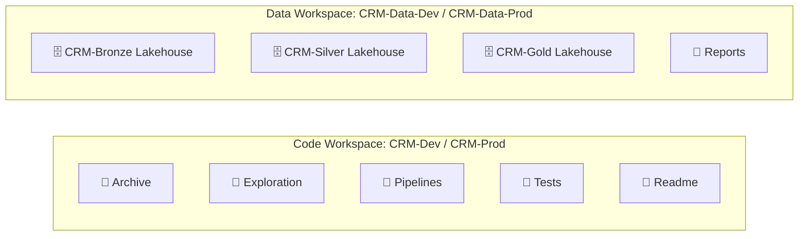

# Fabricon R: Report Promotion Across Environments

> Fabricon R is an extension that can be used with [Fabricon 2](../Fabricon2/README.md), [Fabricon 3](../Fabricon3/README.md) or [Fabricon 4](../Fabricon4/README.md). Use of Fabricon 3 with Fabricon R extension may be referred to as Fabricon 3R and so on.

## The Problem

Teams building Power BI reports on Microsoft Fabric face a multi-layered promotion challenge when moving reports from development to production:

1. **Git integration conflicts**: Fabric assigns each item a `logicalId` per workspace. When syncing a branch across workspaces, logicalIds conflict because the same report gets a different logicalId in each workspace.
2. **Deployment pipeline conflicts**: Same logicalId conflict — pipeline pairing breaks when reports and semantic models have been created independently in each workspace.
3. **Embed URL breaks**: Applications that embed Power BI reports use a `reportId` GUID in the embed URL. This GUID is different in each workspace, so hardcoded embed URLs break on promotion.
4. **Code workspace clutter**: Power BI reports and semantic models generate many files in Git, making the code workspace difficult to manage.

A common workaround is to use a single shared workspace for reports, sacrificing environment isolation. Fabricon R provides a proper solution.

## Core Principle

> Reports and semantic models are data artifacts, not code artifacts. They belong in Data workspaces, not in Git-controlled Code workspaces.

Reports and semantic models are tightly coupled to the lakehouses they read from — not to the notebooks that populate those lakehouses. By placing them in Data workspaces, they are promoted via [Fabric Deployment Pipelines](https://learn.microsoft.com/en-us/fabric/cicd/deployment-pipelines/intro-to-deployment-pipelines) rather than Git, eliminating logicalId conflicts entirely.

## Workspace Structure

Building on [Fabricon 3](../Fabricon3/README.md), which already separates code and data into different workspaces:

| Workspace | Contents | Source Control | Promotion Method |
| --- | --- | --- | --- |
| `CRM-Dev` | Notebooks, pipelines, DevOps notebook | Git (`develop` branch) | PR merge → `CRM-Prod` |
| `CRM-Prod` | Notebooks, pipelines, DevOps notebook | Git (`main` branch) | — |
| `CRM-Data-Dev` | Lakehouses, semantic models, reports | None | Deployment Pipeline → |
| `CRM-Data-Prod` | Lakehouses, semantic models, reports | None | ← Deployment Pipeline target |

> Reports and semantic models live in Data workspaces. This eliminates logicalId conflicts because reports never touch Git.

## Promotion Flow

### Step 1: Code Promotion (Git)

Notebooks and pipelines are promoted via Git, following the branching strategy from [Fabricon 2 - Source Control](../Fabricon2/README.md#source-control):

- Feature branch → PR → `develop` branch (syncs to `CRM-Dev`)
- `develop` → PR → `main` branch (syncs to `CRM-Prod`)

### Step 2: Report and Semantic Model Promotion (Deployment Pipeline)

Reports and semantic models are promoted using a [Fabric Deployment Pipeline](https://learn.microsoft.com/en-us/fabric/cicd/deployment-pipelines/intro-to-deployment-pipelines) configured between `CRM-Data-Dev` and `CRM-Data-Prod`.

> Items must be initially created in `CRM-Data-Dev` and first deployed through the pipeline to establish pairing. Once paired, subsequent deployments update the paired items in `CRM-Data-Prod`.

Important behaviors of deployment pipelines:

- **Lakehouse data is preserved** — deployment pipelines copy metadata only; tables and files in the target workspace are never overwritten.
- **Shortcuts are overwritten** — the pipeline takes the source workspace's shortcut definitions and replaces the target's. Use [Variable Libraries](https://learn.microsoft.com/en-us/fabric/cicd/variable-library/variable-library-overview) for environment-specific shortcut targets.
- **Reports get new IDs** — the `reportId` GUID in the target workspace is different from the source. This is expected behavior.

### Step 3: Post-Deployment Rebind (DevOps Notebook)

After the deployment pipeline completes, the DevOps notebook in the Code workspace (`CRM-Prod`) must be executed to rebind items to the correct environment. The DevOps notebook performs three operations:

1. **Semantic model → Prod lakehouse**: Uses [Semantic Link Labs](https://github.com/microsoft/semantic-link-labs) to update the [Direct Lake](https://learn.microsoft.com/en-us/fabric/fundamentals/direct-lake-overview) model's lakehouse connection.

```python
import sempy_labs.directlake as dl

dl.update_direct_lake_model_lakehouse_connection(
    "CrmReports",              # semantic model name
    data_workspace_id,         # target data workspace
    "CRM-Gold",                # target lakehouse name
    data_workspace_id          # lakehouse workspace
)
```

1. **Report → Prod semantic model**: Uses Semantic Link Labs to rebind the report to the semantic model in the Data workspace.

```python
import sempy_labs.report as rpt

rpt.report_rebind(
    "CrmReports",              # report name
    "CrmReports",              # semantic model name
    None,                      # report workspace (None = current)
    data_workspace_id          # semantic model workspace
)
```

1. **Notebook → Prod lakehouse**: Updates all notebook default lakehouse connections in parallel (existing DevOps notebook functionality, see [Fabricon N - Deployment](../FabriconN/README.md#10-deployment)).

> The DevOps notebook lives in the Code workspace, not the Data workspace. It reaches across to the Data workspace via the `DATA_WORKSPACE_ID` environment variable.

## DevOps Notebook Location

The DevOps notebook is **code** — it belongs in the Git-controlled Code workspace (`CRM-Dev` / `CRM-Prod`), not in the Data workspace. It is promoted via Git along with other notebooks.

The DevOps notebook uses the `DATA_WORKSPACE_ID` environment variable (set by the `Common` notebook) to target the correct Data workspace. See [Fabricon N - Deployment](../FabriconN/README.md#10-deployment) for details on the `Common` notebook pattern.

## Embed URL Strategy

Power BI embed URLs use the following format:

```text
https://app.fabric.microsoft.com/reportEmbed?reportId={reportId}&autoAuth=true&ctid={tenantId}
```

Key observations:

- The `tenantId` is constant across all environments.
- The `reportId` is the only value that differs between Dev and Prod.
- The embed URL does not include a `workspaceId` — the `reportId` alone is globally unique within a tenant.
- The `reportId` in the target workspace is **different** from the source workspace after deployment pipeline promotion.

> Fabricon recommends storing environment-specific `reportId` values in application configuration (e.g., `appsettings.json`).

After a fresh deployment pipeline promotion, update the application configuration with the new Prod `reportId`.

For teams seeking full automation, the `reportId` can be resolved dynamically at runtime using the [Power BI REST API](https://learn.microsoft.com/en-us/rest/api/power-bi/reports/get-reports):

1. Look up the workspace by name: `GET /v1.0/myorg/groups?$filter=name eq 'CRM-Data-Prod'`
2. List reports in the workspace: `GET /v1.0/myorg/groups/{groupId}/reports`
3. Find the report by name and use the `embedUrl` from the response.

This approach eliminates hardcoded `reportId` values entirely.

## What Fabricon R Solves

| Problem | Solution |
| --- | --- |
| Git logicalId conflicts | Reports are not in Git |
| Deployment pipeline logicalId conflicts | Pipeline pairing established via initial deploy from Data-Dev |
| Embed URL breaks on promotion | Environment-specific `reportId` in app config |
| Semantic model points to wrong lakehouse after promotion | DevOps notebook rebinds via Semantic Link Labs |
| Report points to wrong semantic model after promotion | DevOps notebook rebinds via `report_rebind()` |
| Code workspace cluttered with report files | Reports live in Data workspace, not Git-controlled |

## Workspace Folder Structure

With Fabricon R, the Reports folder moves from the Code workspace to the Data workspace:



## Prerequisites

- [Fabric Deployment Pipeline](https://learn.microsoft.com/en-us/fabric/cicd/deployment-pipelines/intro-to-deployment-pipelines) configured between `CRM-Data-Dev` and `CRM-Data-Prod`
- Items initially created in `CRM-Data-Dev` and first deployed through the pipeline to establish pairing
- `DATA_WORKSPACE_ID` environment variable set per Code workspace (via `Common` notebook)
- [semantic-link-labs](https://github.com/microsoft/semantic-link-labs) package available in the Fabric environment
- Power BI REST API access from the embedding application (if using dynamic URL resolution)

## References

- [Fabric Deployment Pipelines](https://learn.microsoft.com/en-us/fabric/cicd/deployment-pipelines/intro-to-deployment-pipelines)
- [Resolve Logical ID Conflicts](https://learn.microsoft.com/en-us/fabric/cicd/git-integration/logical-id-conflict-resolution)
- [Reports - Rebind Report In Group API](https://learn.microsoft.com/en-us/rest/api/power-bi/reports/rebind-report-in-group)
- [Reports - Get Reports In Group API](https://learn.microsoft.com/en-us/rest/api/power-bi/reports/get-reports)
- [Semantic Link Labs](https://github.com/microsoft/semantic-link-labs)
- [Variable Libraries](https://learn.microsoft.com/en-us/fabric/cicd/variable-library/variable-library-overview)
- [Lakehouse Git Integration and Deployment Pipelines](https://learn.microsoft.com/en-us/fabric/data-engineering/lakehouse-git-deployment-pipelines)
